# Phân tích chức năng & UML - IT Task Manager Backend

## 1. Đánh giá sơ đồ "Quản lý Tài khoản"
### 1.1 Nhận xét
- Flow quên mật khẩu trong sơ đồ cũ chỉ thể hiện một use case duy nhất ("Quên mật khẩu") và mở rộng trực tiếp từ "Đăng nhập", trong khi hệ thống thực tế (authController) tách thành hai bước `POST /auth/reset-password/request` và `POST /auth/reset-password/confirm` với khâu xác minh token riêng.
- Việc phát hành Access/Refresh token, token rotation và refresh endpoint (`POST /auth/refresh`) không được mô tả, dẫn tới thiếu hụt logic bảo mật chính của backend.
- Các thao tác nhạy cảm như cập nhật hồ sơ hay đổi mật khẩu đều yêu cầu xác thực lại (re-auth) và validation nâng cao (`authValidation`), nhưng sơ đồ cũ chưa phản ánh mối quan hệ include này.

### 1.2 Sơ đồ đề xuất
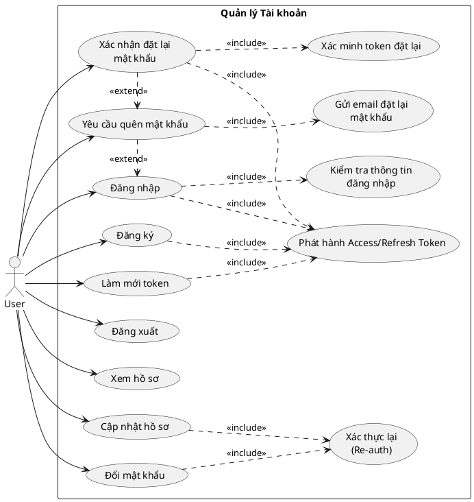

## 2. Đánh giá sơ đồ use case tổng quát
### 2.1 Nhận xét
- Sơ đồ cũ gom tất cả thao tác vào một khối duy nhất nên không thể hiện rõ ranh giới giữa các module thực tế (`auth`, `invite`, `project`, `task`, `column`, `notification`, `search`, `dashboard`).
- Quan hệ include/extend và ràng buộc quyền hạn (Owner vs Member) không xuất hiện, trong khi code backend dùng permission theo vai trò (`projectRolesModel`, `rolesMiddleware`).
- Các tác nhân phụ như dịch vụ email (Nodemailer) hay MeiliSearch ảnh hưởng trực tiếp tới flow nhưng chưa được mô hình hóa.

### 2.2 Sơ đồ tổng quan đề xuất
```plantuml
@startuml
left to right direction
skinparam packageStyle rectangle

actor User
actor "Project Owner/Lead" as Owner
actor "Email Service" as Email

rectangle "Tài khoản & Hồ sơ" {
  usecase "Đăng nhập" as UC_Login
  usecase "Đăng ký" as UC_Register
  usecase "Đổi mật khẩu" as UC_ChangePwd
  usecase "Quên mật khẩu" as UC_ForgotPwd
  usecase "Cập nhật hồ sơ" as UC_UpdateProfile
  usecase "Đăng xuất" as UC_Logout
}

rectangle "Lời mời & Tham gia" {
  usecase "Tạo link mời" as UC_CreateInvite
  usecase "Gửi lời mời email" as UC_SendInvite
  usecase "Danh sách lời mời" as UC_ListInvites
  usecase "Chấp nhận lời mời" as UC_AcceptInvite
  usecase "Từ chối / Hủy lời mời" as UC_RejectInvite
  usecase "Tham gia qua link" as UC_JoinByLink
  usecase "Xác thực token mời" as UC_ValidateInvite
}

rectangle "Quản lý dự án & vai trò" {
  usecase "Tạo / Sửa / Xóa dự án" as UC_CRUDProject
  usecase "Xem dự án" as UC_ViewProject
  usecase "Quản lý thành viên" as UC_ManageMembers
  usecase "Cập nhật vai trò" as UC_UpdateRole
  usecase "Bật Free Mode" as UC_ToggleFreeMode
  usecase "Sắp xếp column" as UC_ReorderColumns
  usecase "Kiểm tra quyền" as UC_CheckPermission
}

rectangle "Board & Task" {
  usecase "Thêm / Sửa / Xóa column" as UC_CRUDColumn
  usecase "Di chuyển card" as UC_MoveCard
  usecase "Thêm / Sửa / Xóa task" as UC_CRUDTask
  usecase "Gán / Gỡ gán task" as UC_AssignTask
  usecase "Cập nhật trạng thái" as UC_UpdateStatus
}

rectangle "Thông báo" {
  usecase "Xem thông báo" as UC_ViewNoti
  usecase "Đánh dấu đã đọc" as UC_ReadNoti
  usecase "Xóa thông báo" as UC_DeleteNoti
  usecase "Xóa tất cả" as UC_ClearNoti
}

rectangle "Tìm kiếm & Dashboard" {
  usecase "Tìm kiếm toàn cục" as UC_GlobalSearch
  usecase "Tìm kiếm dự án/task" as UC_SearchEntities
  usecase "Xem dashboard" as UC_ViewDashboard
  usecase "Thống kê workload" as UC_TeamWorkload
  usecase "Hoạt động dự án" as UC_ProjectActivity
  usecase "Truy vấn MeiliSearch" as UC_QueryMeili
}

Owner --> UC_CreateInvite
Owner --> UC_SendInvite
Owner --> UC_CRUDProject
Owner --> UC_ManageMembers
Owner --> UC_UpdateRole
Owner --> UC_ToggleFreeMode
Owner --> UC_ReorderColumns
Owner --> UC_CheckPermission

User --> UC_Login
User --> UC_Register
User --> UC_ChangePwd
User --> UC_ForgotPwd
User --> UC_UpdateProfile
User --> UC_Logout
User --> UC_ListInvites
User --> UC_AcceptInvite
User --> UC_RejectInvite
User --> UC_JoinByLink
User --> UC_ViewProject
User --> UC_MoveCard
User --> UC_CRUDTask
User --> UC_AssignTask
User --> UC_UpdateStatus
User --> UC_ViewNoti
User --> UC_ReadNoti
User --> UC_DeleteNoti
User --> UC_ClearNoti
User --> UC_GlobalSearch
User --> UC_SearchEntities
User --> UC_ViewDashboard
User --> UC_TeamWorkload
User --> UC_ProjectActivity

Email --> UC_SendInvite

UC_SendInvite ..> UC_CreateInvite : <<include>>
UC_AcceptInvite ..> UC_ValidateInvite : <<include>>
UC_RejectInvite ..> UC_ValidateInvite : <<include>>
UC_JoinByLink ..> UC_ValidateInvite : <<include>>
UC_ManageMembers ..> UC_CheckPermission : <<include>>
UC_UpdateRole ..> UC_CheckPermission : <<include>>
UC_ToggleFreeMode ..> UC_CheckPermission : <<include>>
UC_ReorderColumns ..> UC_CheckPermission : <<include>>
UC_CRUDTask ..> UC_CheckPermission : <<include>>
UC_AssignTask ..> UC_CheckPermission : <<include>>
UC_GlobalSearch ..> UC_QueryMeili : <<include>>
UC_SearchEntities ..> UC_QueryMeili : <<include>>
@enduml
```

## 3. Phạm vi chức năng chính của backend
1. **Quản lý tài khoản & hồ sơ** (authController/authService): đăng ký, đăng nhập, refresh token, quản lý hồ sơ, đổi/quên mật khẩu.
2. **Lời mời & tham gia dự án** (inviteController/inviteService): tạo link, gửi email, chấp nhận/từ chối/hủy lời mời, join qua token.
3. **Quản lý dự án & vai trò** (projectController, projectRolesController, rolesMiddleware): CRUD dự án, quản lý thành viên, phân quyền, free mode, reorder columns.
4. **Quản lý board/column** (columnController/columnService): CRUD column, lấy danh sách theo project, di chuyển card giữa column.
5. **Quản lý task** (taskController/taskService): CRUD, gán/gỡ gán, cập nhật trạng thái, log hoạt động, đồng bộ MeiliSearch.
6. **Thông báo** (notiController/notiService): đọc, xóa, xóa tất cả, lấy chi tiết.
7. **Tìm kiếm & Dashboard** (searchController/searchService, dashboardController/dashboardService): global search qua MeiliSearch, thống kê dự án, workload, activity feed.

## 4. UML chi tiết cho từng chức năng
### 4.1 Quản lý tài khoản & hồ sơ
**Phạm vi**: Các endpoint trong `src/routes/auth`, bao gồm đăng ký/đăng nhập, refresh token, quản lý profile và password, reset password flow.

**Use case**
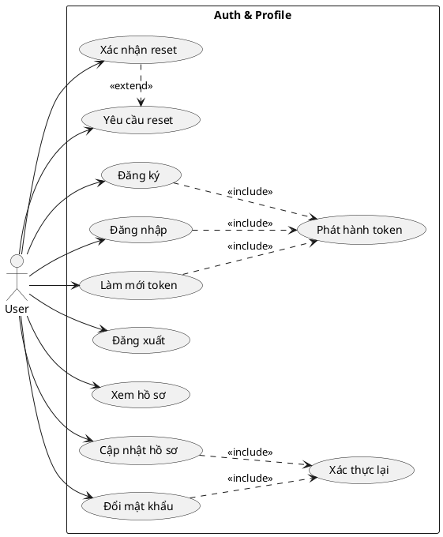

**Sequence (Đăng nhập & phát hành token)**
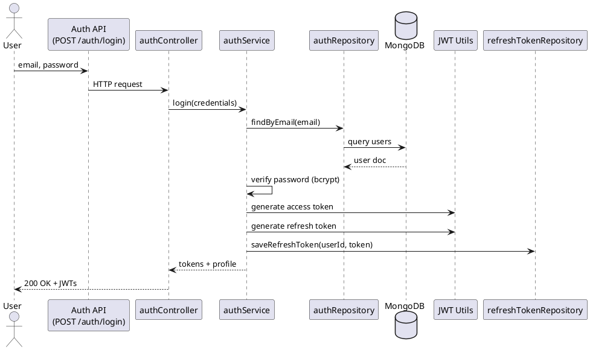

### 4.2 Lời mời & tham gia dự án
**Phạm vi**: `src/routes/home/inviteRoute.js` với các hoạt động tạo link, gửi email, xử lý token khi join.

**Use case**
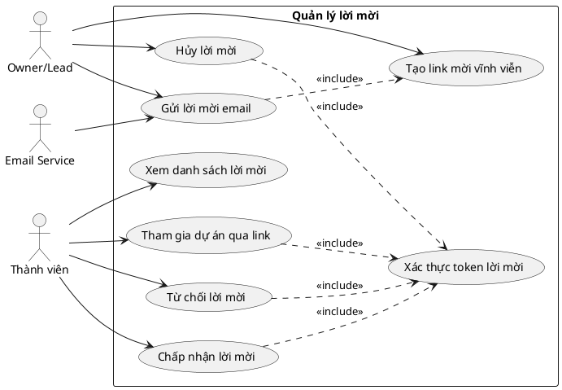

**Sequence (Join dự án qua invite link)**
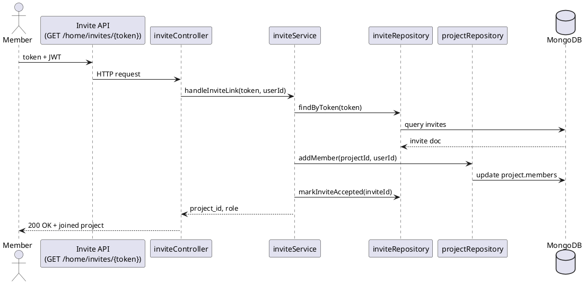

### 4.3 Quản lý dự án & vai trò
**Phạm vi**: `projectController`, `projectRolesController`, các middleware kiểm quyền và service `projectService` (create project, quản lý thành viên, free mode, reorder column).

**Use case**
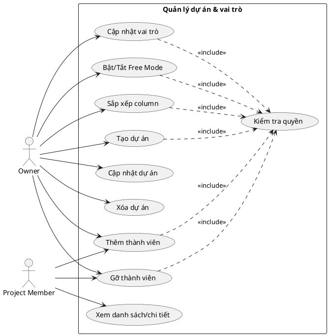

**Sequence (Owner tạo dự án mới)**
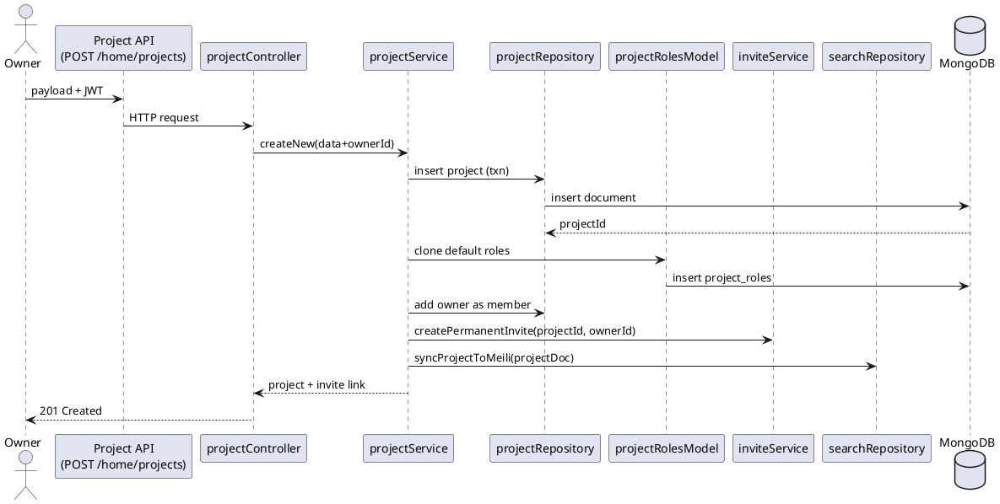

### 4.4 Quản lý column (board)
**Phạm vi**: `columnController`, `columnService`, `columnRepository`, liên quan đến CRUD column và move card.

**Use case**
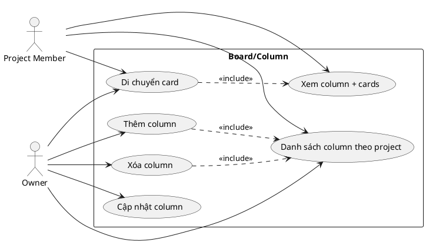

**Sequence (Di chuyển card giữa hai column)**
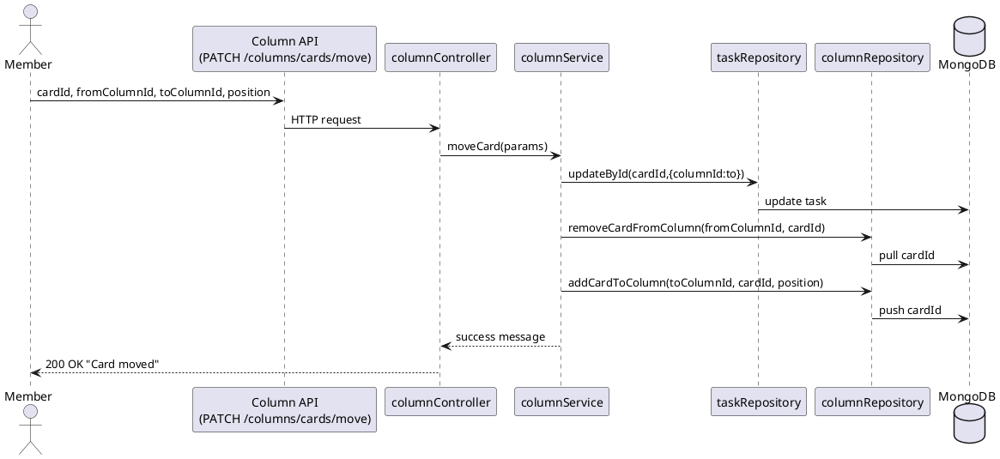

### 4.5 Quản lý task
**Phạm vi**: `taskController`, `taskService`, `taskRepository`, tích hợp với `projectService`, `columnRepository`, MeiliSearch và server log.

**Use case**
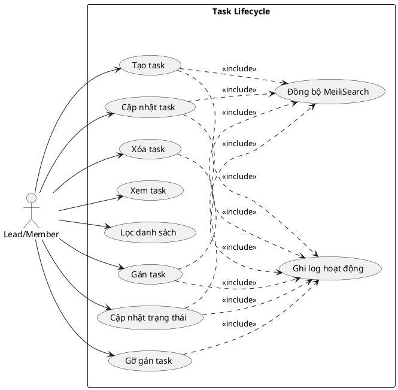

**Sequence (Gán task cho thành viên)**
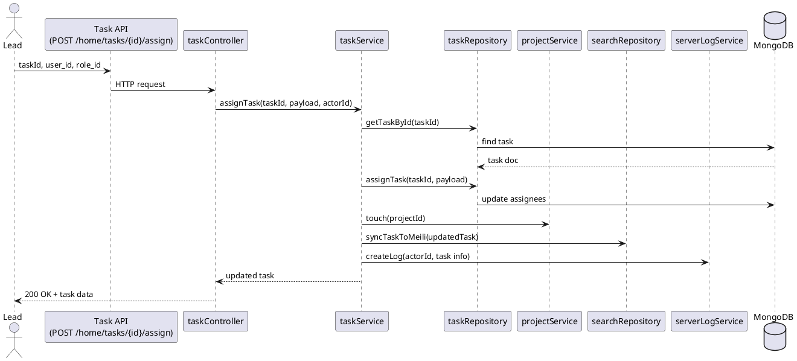

### 4.6 Hệ thống thông báo
**Phạm vi**: `notiController`, `notiService`, `notiRepository`.

**Use case**
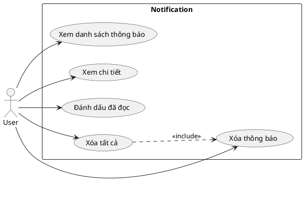

**Sequence (Đánh dấu một thông báo đã đọc)**
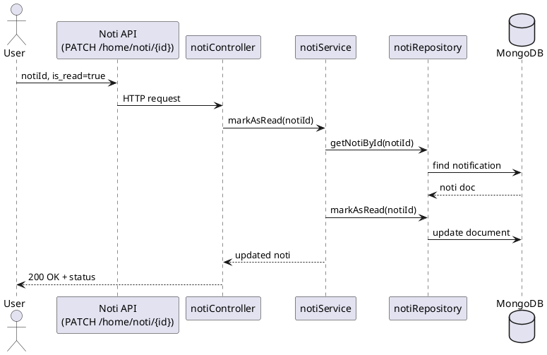

### 4.7 Tìm kiếm & Dashboard
**Phạm vi**: `searchController/searchService` (MeiliSearch), `dashboardController/dashboardService` (thống kê, workload, activity).

**Use case**
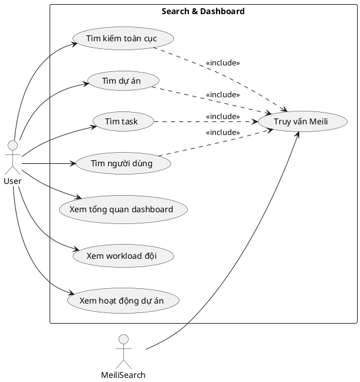

**Sequence (Tìm kiếm toàn cục)**
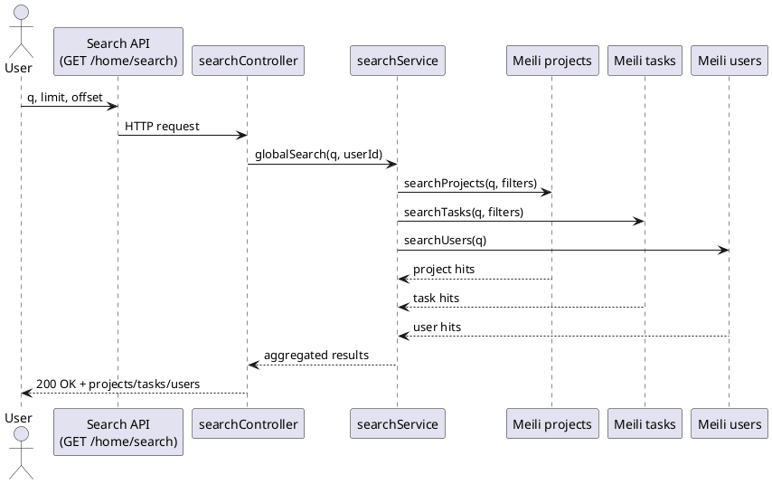

---
Tài liệu này mô tả lại các sơ đồ use case và sequence sát với codebase hiện tại (`src/controllers`, `src/services`, `src/repository`), giúp dễ dàng đối chiếu khi cập nhật tính năng hoặc viết tài liệu hệ thống.
